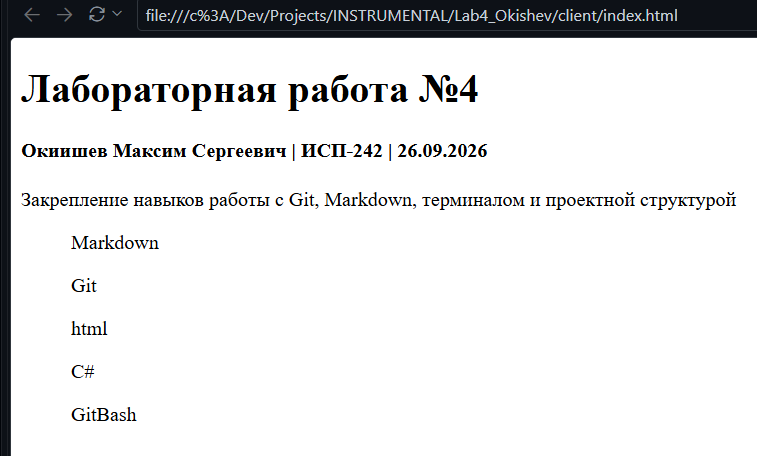

# Лабораторная работа №4 — Git, Markdown, терминал и C#

**Окишев Максим Сергеевич** · группа **ИСП-242**

Закрепление навыков работы с Git, Markdown, терминалом и проектной структурой.
В репозитории лежат две html-страницы, маленькое консольное приложение на C#
и мои примеры разметки. Репозиторий лежит тут:
[Korand-py/Lab4_ISRPO](https://github.com/Korand-py/Lab4_ISRPO).

---

## Содержание

- [Что внутри](#что-внутри)
- [Консольное приложение](#консольное-приложение)
- [Как запустить](#как-запустить)
- [Структура проекта](#структура-проекта)
- [Команды Git](#команды-git)
- [Примеры разметки](#примеры-разметки)
  - [Списки](#списки)
  - [Форматирование](#форматирование)
  - [Блоки кода](#блоки-кода)
  - [Таблицы](#таблицы)
  - [Ссылки и картинки](#ссылки-и-картинки)
  - [Формулы](#формулы)
  - [Цитаты и сноски](#цитаты-и-сноски)
- [Скриншоты](#скриншоты)
- [Чек-лист](#чек-лист)

---

## Что внутри

Лабораторная была на то, чтобы не распыляться, а нормально пощупать руками сразу
несколько вещей: git с консоли, синтаксис markdown, базовую вёрстку в html и
минимальное приложение на C#. Всё разложено по папкам, чтобы было видно, за что
какой каталог отвечает.

- **Git** — репозиторий заведён с нуля, история из пяти коммитов, ветка `Main`
- **Markdown** — этот README как раз и есть результат работы над разметкой
- **HTML** — статичные страницы, без css и js, чистый скелет
- **C#** — консольное приложение на .NET 10, switch-выражения
- **Git Bash** — навигация, работа с файлами, перенаправление вывода

> Терминал — это не наказание, а самый короткий путь к результату.

## Консольное приложение

Приложение спрашивает у пользователя номер пункта меню и печатает соответствующую
строку. ФИО и группа зашиты в коде, дата и время берутся в момент запуска.

| Ввод | Что выводится                     | Источник значения      |
| ---- | --------------------------------- | ---------------------- |
| `1`  | ФИО студента                      | переменная `fio`       |
| `2`  | Номер группы                      | переменная `group`     |
| `3`  | Текущая дата и время              | `DateTime.Now`         |
| *другое* | `Выход`                    | значение по умолчанию |

Логика целиком в одном файле — `server/program.cs`, ничего лишнего я пока не
подключал, `using System.Diagnostics` и `System.Globalization` из шаблона
`dotnet new` убрать забыл.

## Как запустить

```bash
git clone https://github.com/Korand-py/Lab4_ISRPO.git
cd Lab4_ISRPO
cd server
dotnet run
```

После `dotnet run` ждём номер и вводим, например, `1` — программа ответит
`ФИО: Окишев Максим Сергеевич`. Страницы открываются просто в браузере:
`client/index.html` и `client/about.html`.

> [!NOTE]
> Билд собирается автоматически в `server/bin/Debug/net10.0/`, отдельная
> установка ничего не требует.

> [!TIP]
> Собрать без запуска — `dotnet build`, вычистить кэш сборки — `dotnet clean`,
> а посмотреть, какая версия SDK стоит — `dotnet --version`.

> [!WARNING]
> Папки `bin` и `obj` закоммичивать не надо, они должны быть в `.gitignore`.
> У меня туда попали первые разы, пришлось переделывать историю.

## Структура проекта

```text
Lab4_ISRPO/
├── client/            # статические страницы
│   ├── index.html
│   └── about.html
├── server/            # консольное приложение на C#
│   ├── program.cs
│   └── server.csproj
├── data/
│   └── text.txt
├── docs/
│   ├── markdown_examples.md
│   └── latex_examples.md
├── img/
│   └── index_html.png
├── logs/
│   └── app.log
├── terminal_pracrice/ # задания из Git Bash
│   ├── data.txt
│   └── logs.txt
├── repo/              # папка под локальный клон
└── README.md
```

- **client/**
  - `index.html` — титульный лист лабораторной
  - `about.html` — страница «Обо мне»
- **server/**
  - `program.cs` — точка входа, чтение из консоли и вывод
  - `server.csproj` — файл проекта, `net10.0`
- **docs/**
  - `markdown_examples.md` — то, что я сверял при оформлении README
  - `latex_examples.md` — примеры формул, чтобы не забыть синтаксис
- **img/**
  - `index_html.png` — скриншот открытой страницы
- **logs/**
  - `app.log` — сюда перенаправлял вывод программы
- **terminal_pracrice/**
  - `data.txt` — результат работы с cat, head, tail, wc
  - `logs.txt` — то же самое, но через конвейер и grep

## Команды Git

Всё делал из терминала, без IDE.

```bash
git clone https://github.com/Korand-py/Lab4_ISRPO.git
cd Lab4_ISRPO
git status
git add .
git commit -m "Коммит 1"
git push origin Main
```

Последние коммиты:

| Хеш       | Дата       | Сообщение                        |
| --------- | ---------- | -------------------------------- |
| `486b32c` | 2026-10-02 | Примеры markdown                 |
| `8bb461c` | 2026-10-02 | C# APP                           |
| `583ef81` | 2026-09-26 | Коммит 3 наполнение about.html   |
| `469c732` | 2026-09-26 | Коммит 2 - наполнение inde.html  |
| `ac5796f` | 2026-09-26 | Коммит 1                         |

Полезное, что пригодилось по дороге:

- `git log --oneline --graph` — смотреть историю компактно
- `git restore` — откатить изменения файла, не трогая репозиторий
- `git switch -c Main` — завести ветку сразу, а не позже

## Примеры разметки

Дальше идёт то, ради чего вообще затевалась лабораторная — проверка, что
markdown умеет всё, что мне нужно.

### Списки

Маркированный:

- Markdown
- Git
- HTML

Нумерованный:

1. Создать репозиторий
2. Добавить файлы
3. Сделать коммит
4. Залить на GitHub

Вложенный:

- Клиентская часть
  - `index.html` — титульный лист
  - `about.html` — страница обо мне
- Серверная часть
  - `program.cs` — логика меню
  - `server.csproj` — конфигурация проекта

### Форматирование

Текст можно выделить **полужирным**, сделать *курсивным*, ~~зачеркнуть~~ или
записать `моноширным` шрифтом. Комбинируется и так: ***полужирный курсив***
и **полужирный `код`**. Умеет и ссылку с подписью: [вот так](#ссылки-и-картинки).

### Блоки кода

С указанием языка подсветка работает, без указания — нет.

```csharp
string fio = "Окишев Максим Сергеевич";
string group = "ИСП-242";

int number = Convert.ToInt32(Console.ReadLine());
string text = number switch
{
    1 => $"ФИО: {fio}",
    2 => $"Группа: {group}",
    3 => $"Дата и время: {DateTime.Now}",
    _ => "Выход",
};
```

```bash
cd server
dotnet run
```

### Таблицы

| Команда                | Что делает                        | Где применял               |
| ---------------------- | --------------------------------- | -------------------------- |
| `git clone`            | скачивает репозиторий             | в начале работы            |
| `git commit -m`        | фиксирует изменения               | после каждого логического шага |
| `git push origin Main` | отправляет коммиты на GitHub      | в конце работы             |
| `wc -l`                | считает строки в файле            | на `terminal_pracrice/data.txt` |
| `grep -n`              | ищет строку и показывает номер    | на `logs/app.log`          |
| `git restore`          | отменяет правки файла             | когда накосячил с html     |

### Ссылки и картинки

Внешняя ссылка — на сам репозиторий:
[github.com/Korand-py/Lab4_ISRPO](https://github.com/Korand-py/Lab4_ISRPO),
ещё можно [загуглить что-нибудь](https://www.google.com).

Внутренняя ссылка — на раздел этого же файла:
[вернуться к содержанию](#содержание).

Картинки тоже из markdown, главное положить файл в папку `img/` и указать путь
относительно README:

```markdown

```


### Формулы

Поддерживается и в строку, и отдельным блоком. Например, площадь круга
$S = \pi r^2$, а сумма элементов арифметической прогрессии выводится так:

$$
\sum_{i=1}^{n} i = \frac{n(n+1)}{2}
$$

Или теорема Пифагора, $a^2 + b^2 = c^2$, если нужно вспомнить, что это
треугольник. Блок формул:

$$
f(x) = \begin{cases}
1, & x \in \mathbb{N} \\
0, & \text{иначе}
\end{cases}
$$

### Цитаты и сноски

> Оформление — это не отдельная задача, это часть задачи.

Вот так выглядит сноска[^1] — ссылка внизу страницы, а сам текст живёт
отдельно и не мешает читать.

[^1]: README должен быть информативным.

## Скриншоты

Вот так выглядит открытая страница `client/index.html`:


Скриншоты снимал через `Win + Shift + S`, складывал в `img/`, в README вставлял
относительным путём, чтобы картинка не ломалась при переносе репозитория.

> [!TIP]
> Имя файла лучше делать осмысленным!

## Чек-лист

- [x] `git init`, ветка `Main`
- [x] Коммиты по ходу работы, а не всё одним куском
- [x] `git push` на GitHub
- [x] `client/index.html` — титульный лист
- [x] `client/about.html` — страница «Обо мне»
- [x] `server/program.cs` — приложение собирается и запускается
- [x] README с разметкой: списки, таблицы, код, ссылки, картинки
- [x] Скриншот страницы в `img/`
